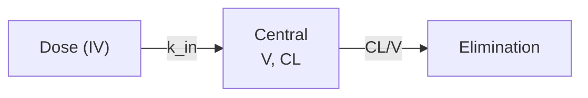
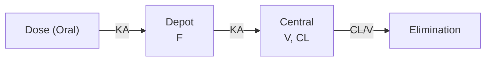
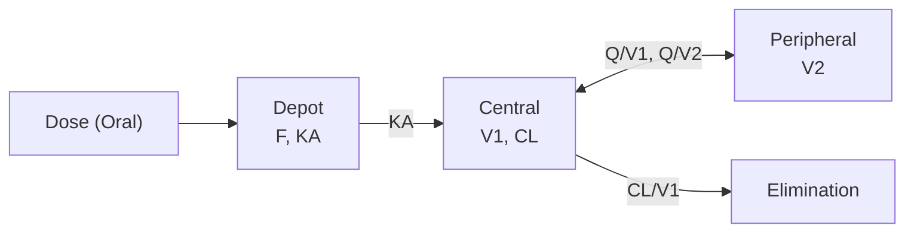
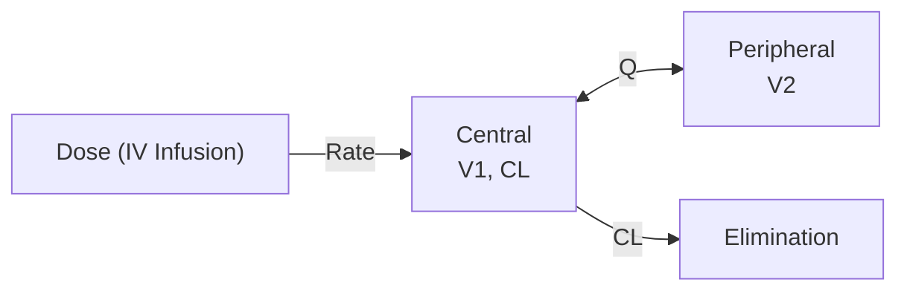
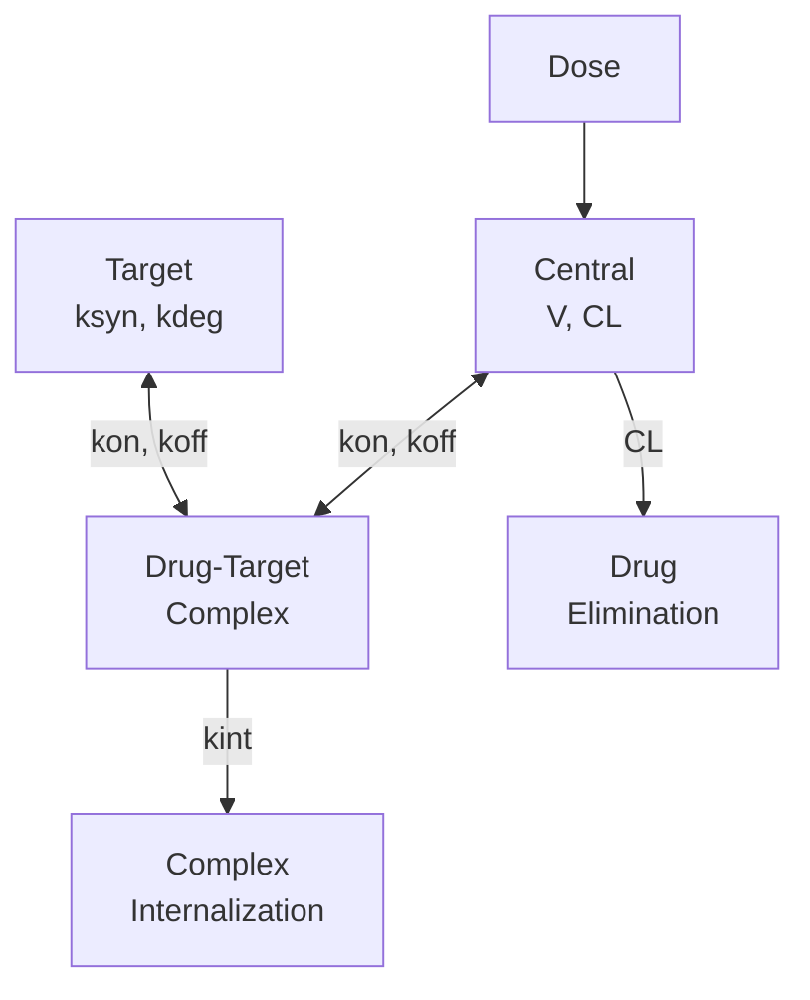
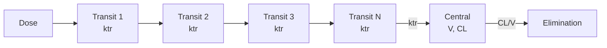
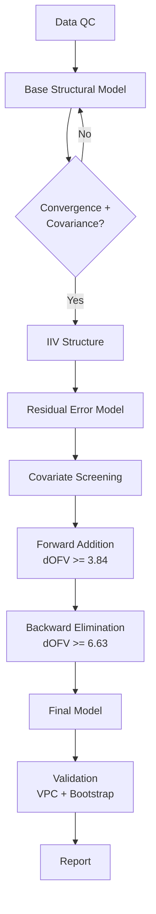
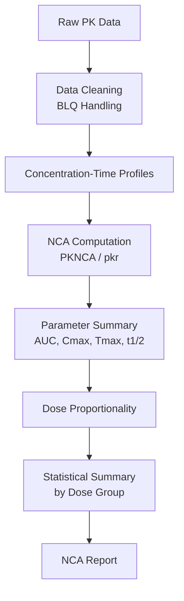

# PK Diagram Generator

## Usage
```
/pk-diagram compartment 2cmt-oral
/pk-diagram workflow model-development
/pk-diagram dataflow "SDTM to ADaM to NONMEM"
/pk-diagram decision "error model selection"
/pk-diagram custom "Show the covariate testing workflow with forward addition and backward elimination"
```

## Arguments

`$ARGUMENTS` is parsed as: `<type> <specification>`

Types: `compartment`, `workflow`, `dataflow`, `decision`, `custom`

## Protocol

### Step 1: Parse Arguments

Extract diagram type and specification from `$ARGUMENTS`.

### Step 2: Generate Mermaid Code

Use the built-in templates below for known types, or generate from the specification for custom diagrams.

### Step 3: Render via Mermaid Chart Plugin

Call `mcp__claude_ai_Mermaid_Chart__validate_and_render_mermaid_diagram` with:
- `prompt`: description of the diagram
- `mermaidCode`: the generated Mermaid code
- `diagramType`: `flowchart` for most, `sequenceDiagram` for workflows
- `clientName`: `claude`

### Step 4: Present Output

Show the rendered diagram and provide the raw Mermaid code block for embedding in Quarto reports:

````
```{mermaid}
<mermaid code here>
```
````

---

## Built-in Compartment Model Templates

### 1-CMT IV Bolus


### 1-CMT Oral (First-Order Absorption)


### 2-CMT Oral (First-Order Absorption)


### 2-CMT IV Infusion


### TMDD (Quasi-Steady-State)


### Transit Compartment Absorption


## Workflow Templates

### Model Development


### NCA Pipeline


## Custom Diagrams

For `custom` type, generate appropriate Mermaid code from the user's text description. Choose the best diagram type:
- `flowchart TD` or `flowchart LR` for processes and workflows
- `sequenceDiagram` for time-ordered interactions
- `gantt` for timelines
- `classDiagram` for data structures
- `stateDiagram-v2` for state machines

## Non-Negotiables

- Always render via the Mermaid Chart plugin (don't just return raw code)
- Always ALSO provide the raw Mermaid code for Quarto embedding
- Use consistent node styling across diagrams
- Label all arrows with rate constants or descriptions
