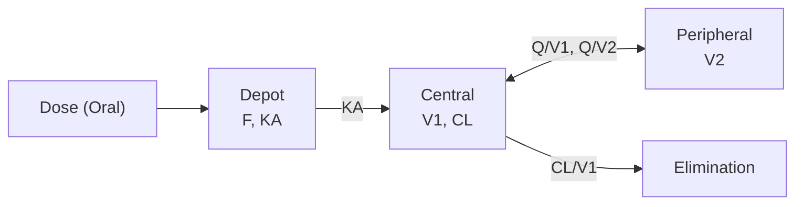
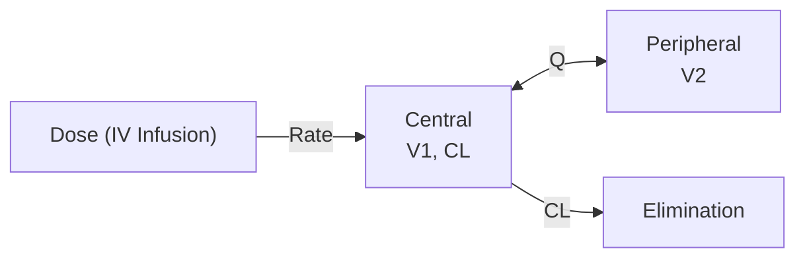
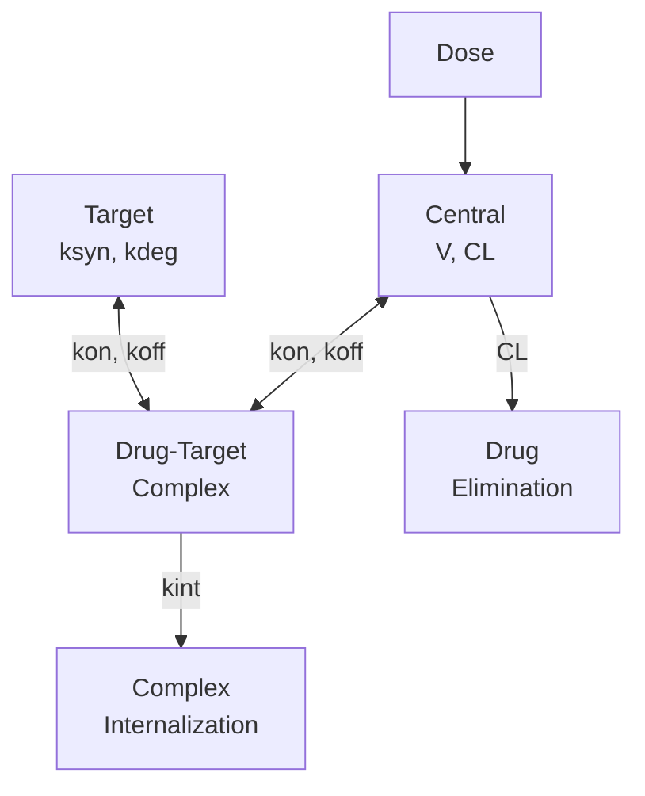
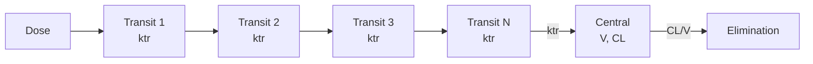
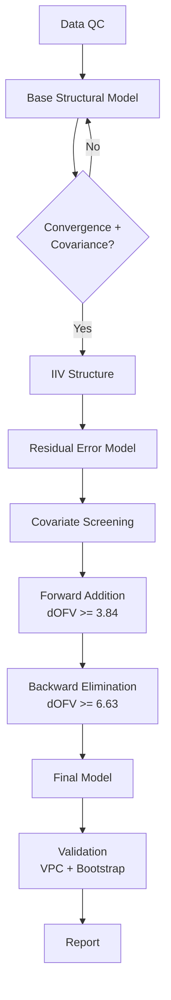
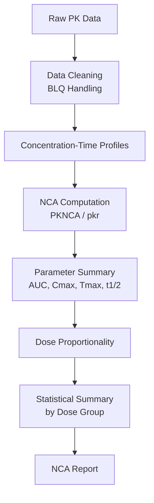

# Plugin-First R/Quarto/Mermaid Enhancement — Implementation Plan

> **For Claude:** REQUIRED SUB-SKILL: Use superpowers:executing-plans to implement this plan task-by-task.

**Goal:** Add Context7 live docs, Mermaid diagrams, 5 new analysis skills with Quarto templates, and PMX-aware agent upgrades to the PK_Claude template.

**Architecture:** 16 files across 6 tasks. Rules auto-trigger on R/qmd paths. Skills scaffold Quarto reports from templates. Agents get new PMX review categories. No tests (template repo) — verification via frontmatter checks, grep, and git.

**Tech Stack:** Claude Code rules/skills/agents, MCP plugins (Context7, Mermaid Chart), R (PKNCA, pkr, mrgsolve, rxode2, ggplot2, gt, flextable), Quarto

---

## Task 1: Create Rules (2 files)

**Files:**
- Create: `.claude/rules/context7-docs.md`
- Create: `.claude/rules/pmx-r-patterns.md`

### Step 1: Create Context7 docs rule

Create `.claude/rules/context7-docs.md`:

```markdown
---
paths:
  - "**/*.R"
  - "**/*.qmd"
  - "scripts/**"
---

# Context7 Live Documentation for PMX R Packages

**Before writing or modifying R code that uses PMX packages, fetch current documentation from Context7.**

## When to Fetch

Use Context7 (`resolve-library-id` then `query-docs`) when:
- Writing new R code that imports a Tier 1 or Tier 2 package
- Unsure about function signatures, arguments, or return values
- The user asks about a package API or best practice

Do NOT fetch for:
- Simple base R operations
- Code you've already verified in this session
- Trivial tidyverse operations (filter, mutate, select)

## Package Tiers

### Tier 1 — Core PMX (always check before first use in session)
xpose, mrgsolve, rxode2, PKNCA, vpc, nlmixr2, pkr

### Tier 2 — Simulation/ODE (check when writing simulation code)
PKPDsim, posologyr, linpk, nlmixr2est, babelmixr2

### Tier 3 — Tidyverse (check only for non-trivial usage)
dplyr, tidyr, purrr, stringr, readr, forcats, lubridate

### Tier 4 — Visualization (check when building figures/tables)
ggplot2, Plotly, patchwork, cowplot, GGally, gganimate, gt, flextable, officer

### Tier 5 — Pipeline (check when setting up workflow)
targets

## How to Fetch

1. Call `resolve-library-id` with the package name
2. Call `query-docs` with the resolved ID and your specific question
3. Use the returned documentation to write correct code

## Example

Before writing NCA code:
1. `resolve-library-id(libraryName="PKNCA", query="NCA analysis workflow")`
2. `query-docs(libraryId="<resolved-id>", query="PKNCAconc PKNCAdata pk.nca workflow example")`
3. Write code using the documented API
```

### Step 2: Create PMX R patterns rule

Create `.claude/rules/pmx-r-patterns.md`:

```markdown
---
paths:
  - "**/*.R"
  - "**/*.qmd"
---

# PMX R Code Patterns

**Mandatory patterns for all pharmacometrics R code in this project.**

## Reproducibility

- `set.seed()` REQUIRED in any script that uses simulation (rxode2, mrgsolve, sample, rnorm)
- `here::here()` for all file paths — never absolute paths
- All packages loaded at top of script via `library()`

## Figures

- `dpi = 300` for all `ggsave()` calls
- Explicit `fig.width` and `fig.height` in all Quarto chunk options
- GOF plots: always `type = "ps"` (points + smooth)
- Never use `ggplotly()` — use native Plotly (`plot_ly()`) if interactivity needed
- Use MM color palette from `.claude/rules/r-code-conventions.md`

## Tables

- No hardcoded values — always pull from R objects
- Use `gt` or `flextable` for formatted tables
- Include units in column headers
- Numeric formatting: 3 significant figures for PK parameters, 1 decimal for percentages

## Simulation Scripts

- Document dose scenarios in a comment block at top
- Use named parameter vectors (not positional)
- Always propagate parameter uncertainty when bootstrap results available
- Check for negative concentrations in output and flag as warning

## Report Templates

- All analysis reports go in `reports/` directory
- Use Quarto `.qmd` format with YAML header specifying `format: html`
- Include `date: today` and `author` in YAML
- Cross-reference figures and tables using Quarto syntax (`@fig-name`, `@tbl-name`)
```

### Step 3: Verify rules

Run: Grep for `^paths:` in both new files to confirm frontmatter is correct.

### Step 4: Commit

```bash
git add .claude/rules/context7-docs.md .claude/rules/pmx-r-patterns.md
git commit -m "feat: add Context7 docs rule and PMX R patterns rule"
```

---

## Task 2: Create Mermaid Diagram Skill (1 file)

**Files:**
- Create: `.claude/skills/pk-diagram/SKILL.md`

### Step 1: Create skill directory and SKILL.md

Create `.claude/skills/pk-diagram/SKILL.md`:

```markdown
---
name: pk-diagram
description: Generate PK-relevant Mermaid diagrams - compartment models, workflow charts, data flow diagrams, and decision trees
---

# PK Diagram Generator

## Usage
```
/pk-diagram compartment 2cmt-oral
/pk-diagram workflow model-development
/pk-diagram dataflow "SDTM to ADaM to NONMEM"
/pk-diagram decision "error model selection"
/pk-diagram custom "Show the covariate testing workflow with forward addition and backward elimination"
```

## Arguments

`$ARGUMENTS` is parsed as: `<type> <specification>`

Types: `compartment`, `workflow`, `dataflow`, `decision`, `custom`

## Protocol

### Step 1: Parse Arguments

Extract diagram type and specification from `$ARGUMENTS`.

### Step 2: Generate Mermaid Code

Use the built-in templates below for known types, or generate from the specification for custom diagrams.

### Step 3: Render via Mermaid Chart Plugin

Call `mcp__claude_ai_Mermaid_Chart__validate_and_render_mermaid_diagram` with:
- `prompt`: description of the diagram
- `mermaidCode`: the generated Mermaid code
- `diagramType`: `flowchart` for most, `sequenceDiagram` for workflows
- `clientName`: `claude`

### Step 4: Present Output

Show the rendered diagram and provide the raw Mermaid code block for embedding in Quarto reports:

````
```{mermaid}
<mermaid code here>
```
````

---

## Built-in Compartment Model Templates

### 1-CMT IV Bolus


### 1-CMT Oral (First-Order Absorption)


### 2-CMT Oral (First-Order Absorption)


### 2-CMT IV Infusion


### TMDD (Quasi-Steady-State)


### Transit Compartment Absorption


## Workflow Templates

### Model Development


### NCA Pipeline


## Custom Diagrams

For `custom` type, generate appropriate Mermaid code from the user's text description. Choose the best diagram type:
- `flowchart TD` or `flowchart LR` for processes and workflows
- `sequenceDiagram` for time-ordered interactions
- `gantt` for timelines
- `classDiagram` for data structures
- `stateDiagram-v2` for state machines

## Non-Negotiables

- Always render via the Mermaid Chart plugin (don't just return raw code)
- Always ALSO provide the raw Mermaid code for Quarto embedding
- Use consistent node styling across diagrams
- Label all arrows with rate constants or descriptions
```

### Step 2: Commit

```bash
git add .claude/skills/pk-diagram/SKILL.md
git commit -m "feat: add /pk-diagram skill with Mermaid Chart integration"
```

---

## Task 3: Create Analysis Skills (5 files)

**Files:**
- Create: `.claude/skills/nca-analysis/SKILL.md`
- Create: `.claude/skills/er-analysis/SKILL.md`
- Create: `.claude/skills/simulate-pk/SKILL.md`
- Create: `.claude/skills/tfl-generator/SKILL.md`
- Create: `.claude/skills/eda/SKILL.md`

### Step 1: Create NCA analysis skill

Create `.claude/skills/nca-analysis/SKILL.md`:

```markdown
---
name: nca-analysis
description: Non-compartmental analysis workflow using PKNCA and pkr. Scaffolds a complete Quarto report with concentration-time profiles, NCA parameters, and summary statistics.
---

# NCA Analysis

## Usage
```
/nca-analysis
/nca-analysis <dataset_path>
```

## What This Does

Scaffolds a complete NCA analysis as a Quarto report:
1. Load and prepare PK concentration data
2. Generate concentration-time profiles (linear + semi-log)
3. Compute NCA parameters via PKNCA (AUC, Cmax, Tmax, t1/2, CL/F, Vz/F)
4. Summarize by dose group with descriptive statistics
5. Assess dose proportionality
6. Document BLQ handling approach

## Protocol

### Step 1: Fetch Documentation
Use Context7 to get current PKNCA and pkr documentation:
- `resolve-library-id` for PKNCA
- `query-docs` for PKNCAconc, PKNCAdata, pk.nca workflow

### Step 2: Identify Dataset
If `$ARGUMENTS` provides a path, use it. Otherwise ask the user for:
- Dataset location (in `data/derived/`)
- Key columns: Subject ID, Time, Concentration, Dose, Treatment/Group
- BLQ handling preference (set to 0, set to LLOQ/2, exclude)
- Dosing information (single dose, steady-state, multiple dose)

### Step 3: Scaffold Report
Copy `templates/nca-report.qmd` to `reports/` with a descriptive name.
Fill in the YAML header and data path placeholders.

### Step 4: Customize R Code
Adapt the template code chunks for the user's dataset:
- Column name mapping
- BLQ handling method
- NCA intervals appropriate for dosing regimen
- Dose groups for stratification

### Step 5: Generate and Review
- Render the Quarto report
- Review NCA parameter ranges for physiological plausibility
- Flag any issues (negative AUC, unreasonable t1/2, etc.)

## Non-Negotiables
- Use `here::here()` for all file paths
- Use PKNCA (not manual trapezoidal calculation)
- Linear-up/log-down trapezoidal method as default
- All figures at dpi = 300
- No hardcoded parameter values in summary tables
```

### Step 2: Create E-R analysis skill

Create `.claude/skills/er-analysis/SKILL.md`:

```markdown
---
name: er-analysis
description: Exposure-response analysis workflow. Scaffolds Quarto report with E-R scatter plots, logistic/Cox regression, forest plots, and dose-response curves.
---

# Exposure-Response Analysis

## Usage
```
/er-analysis
/er-analysis <dataset_path>
```

## What This Does

Scaffolds a complete exposure-response analysis as a Quarto report:
1. Load PK exposure metrics and clinical endpoints
2. Exploratory E-R scatter plots (efficacy + safety)
3. Fit appropriate models (logistic, linear, Cox PH)
4. Generate forest plots for subgroup effects
5. Dose-response curves with confidence intervals

## Protocol

### Step 1: Fetch Documentation
Use Context7 for ggplot2, gt, and relevant modeling packages.

### Step 2: Identify Data and Endpoints
Ask the user for:
- Dataset with exposure metrics (AUC, Cmax, Ctrough) and endpoints
- Efficacy endpoint(s): binary (response/no response), continuous (change from baseline), or time-to-event
- Safety endpoint(s): if applicable
- Key covariates for subgroup analysis
- Exposure metric preference (AUC_ss, Cmax, Ctrough, or all)

### Step 3: Scaffold Report
Copy `templates/er-report.qmd` to `reports/`.
Adapt for the user's endpoints and exposure metrics.

### Step 4: Customize Analysis
- Select appropriate model type based on endpoint:
  - Binary → logistic regression (`glm(..., family = binomial)`)
  - Continuous → linear regression or ANCOVA
  - Time-to-event → Cox PH (`survival::coxph`)
- Set up subgroup variables for forest plot
- Configure dose-response visualization

### Step 5: Generate and Review
- Render the Quarto report
- Check E-R relationship direction is clinically plausible
- Verify forest plot subgroups are meaningful

## Non-Negotiables
- Always show graphical E-R assessment before formal modeling
- Include exposure metric derivation documentation
- Forest plots must include overall effect + subgroups
- Confidence intervals on all model predictions
- No p-value hacking — pre-specify analysis plan
```

### Step 3: Create simulation skill

Create `.claude/skills/simulate-pk/SKILL.md`:

```markdown
---
name: simulate-pk
description: PK/PD simulation workflow using rxode2 or mrgsolve. Scaffolds dose scenarios, population simulations, and prediction interval plots.
---

# PK/PD Simulation

## Usage
```
/simulate
/simulate rxode2
/simulate mrgsolve
/simulate <run_number>
```

## What This Does

Scaffolds a PK/PD simulation workflow:
1. Define or load model parameters (from NONMEM run or manual input)
2. Set up dose scenarios
3. Run population simulations with variability
4. Generate spaghetti + median/PI plots
5. Optionally propagate parameter uncertainty

## Protocol

### Step 1: Fetch Documentation
Use Context7 for the selected engine (rxode2 or mrgsolve).

### Step 2: Determine Model Source
If `$ARGUMENTS` is a run number:
- Load parameters from NONMEM output using xpose/aipharma
- Translate NONMEM model structure to rxode2/mrgsolve syntax

If no run number:
- Ask user for model structure and parameters
- Or use a previously defined model file

### Step 3: Define Dose Scenarios
Ask user for:
- Dose levels and regimens
- Number of subjects per scenario
- Simulation duration
- Special populations (if covariate effects included)

### Step 4: Scaffold Report
Copy `templates/simulation-report.qmd` to `reports/`.
Configure for selected engine and scenarios.

### Step 5: Generate Simulations
- Set `set.seed()` for reproducibility
- Run N subjects per scenario (default: 1000)
- Calculate median and 90% prediction intervals
- Generate:
  - Spaghetti plots (individual profiles)
  - Median + PI ribbon plots
  - Dose comparison overlays

### Step 6: Review
- Check no negative concentrations
- Verify steady-state achieved if applicable
- Compare to observed data if available

## Non-Negotiables
- `set.seed()` at top of every simulation script
- Named parameter vectors (not positional)
- Document all dose scenarios in header comments
- dpi = 300 for all figures
- Include parameter uncertainty propagation when bootstrap available
```

### Step 4: Create TFL generator skill

Create `.claude/skills/tfl-generator/SKILL.md`:

```markdown
---
name: tfl-generator
description: Generate submission-ready Tables, Figures, and Listings (TFLs) for pharmacometric analyses using gt, flextable, and ggplot2.
---

# TFL Generator

## Usage
```
/tfl-generator
/tfl-generator <dataset_path>
/tfl-generator <type>
```

Types: `demographics`, `pk-summary`, `parameter-table`, `forest-plot`, `conc-time`, `listing`

## What This Does

Generates publication/submission-ready Tables, Figures, and Listings:
1. Formatted tables via gt or flextable with MM styling
2. ggplot2 figures at 300 DPI with consistent theme
3. Data listings with appropriate formatting
4. Assembled Quarto document with all TFLs

## Protocol

### Step 1: Fetch Documentation
Use Context7 for gt, flextable, and ggplot2.

### Step 2: Determine TFL Requirements
Ask user for:
- TFL type(s) needed
- Dataset location
- Output format (HTML for review, PDF/DOCX for submission)
- Specific formatting requirements (sponsor shell, standard headers/footers)

### Step 3: Scaffold Report
Copy `templates/tfl-report.qmd` to `reports/`.

### Step 4: Generate TFLs

**Demographics Table:**
- N, Age (mean, SD, range), Sex, Race, Weight, BMI, eGFR
- By treatment group with total column
- Using gt with MM styling

**PK Summary Table:**
- Cmax, Tmax, AUC, t1/2 by dose group and visit
- Geometric mean + CV% for log-normal parameters
- Arithmetic mean + SD for others

**Parameter Estimate Table:**
- From NONMEM output: Estimate, RSE%, IIV CV%, Shrinkage%
- Formatted with appropriate significant figures

**Concentration-Time Figure:**
- Linear and semi-log scales
- By dose group, with mean + SD overlay
- Individual profiles as light lines

**Forest Plot:**
- Covariate effects on key parameters
- Reference line at 1.0 (or appropriate null)
- 90% CI bars

**Data Listing:**
- Subject-level data in tabular format
- Sorted by subject, time
- Flagged BLQ and excluded records

## Non-Negotiables
- No hardcoded values — all from R objects
- gt/flextable for tables (not knitr::kable for final output)
- dpi = 300 for all figures, width = 6.5 inches for submission
- Include table/figure numbers and titles
- MM color palette for all visualizations
```

### Step 5: Create EDA skill

Create `.claude/skills/eda/SKILL.md`:

```markdown
---
name: eda
description: Exploratory Data Analysis for clinical and PK datasets. Scaffolds a comprehensive Quarto report with demographics, PK summaries, covariate distributions, and data quality assessment.
---

# Exploratory Data Analysis

## Usage
```
/eda
/eda <dataset_path>
```

## What This Does

Scaffolds a comprehensive EDA report:
1. Demographics summary
2. PK concentration summary by dose, visit, analyte
3. Covariate distributions and correlations
4. Missing data assessment
5. Outlier detection
6. Dataset quality flags

## Protocol

### Step 1: Fetch Documentation
Use Context7 for ggplot2, gt, and data manipulation packages.

### Step 2: Identify Dataset
If `$ARGUMENTS` provides a path, use it. Otherwise ask for:
- Dataset location
- Dataset type (PK, PD, PKPD, demographics, lab data)
- Key column names (ID, TIME, DV, DOSE, covariates)
- Any known data issues or exclusions

### Step 3: Scaffold Report
Copy `templates/eda-report.qmd` to `reports/`.

### Step 4: Customize Sections

**Demographics:**
- Summary table: N, Age, Sex, Race, Weight, Height, BMI, renal/hepatic function
- Stratified by treatment group
- Balance assessment across groups

**PK Concentrations:**
- N observations by dose, visit, timepoint
- BLQ summary (count and percentage by timepoint)
- Concentration-time spaghetti plots (linear + semi-log)
- Dose-normalized concentrations if multiple dose levels

**Covariates:**
- Histograms/density plots for continuous covariates
- Bar charts for categorical covariates
- Correlation matrix (continuous covariates)
- Covariate vs PK parameter scatter plots (if individual estimates available)

**Missing Data:**
- Missing data pattern visualization
- Percentage missing by variable
- Assessment of missingness mechanism (MCAR/MAR/MNAR)

**Outliers:**
- Statistical outlier detection (e.g., > 3 SD from mean)
- Visual outlier flagging on concentration-time plots
- Listing of flagged observations for review

**Data Quality:**
- Duplicate record check
- Time sequence validation (no negative time gaps)
- Dose-concentration consistency
- BLQ below actual LLOQ value

### Step 5: Generate and Review
- Render the Quarto report
- Summarize key findings
- Flag data issues requiring resolution before modeling

## Non-Negotiables
- All figures at dpi = 300
- Use `here::here()` for file paths
- No hardcoded values in summary tables
- Use MM color palette
- Document all data exclusions with rationale
```

### Step 6: Commit

```bash
git add .claude/skills/nca-analysis/SKILL.md .claude/skills/er-analysis/SKILL.md .claude/skills/simulate-pk/SKILL.md .claude/skills/tfl-generator/SKILL.md .claude/skills/eda/SKILL.md
git commit -m "feat: add 5 PMX analysis skills (NCA, E-R, simulate, TFL, EDA)"
```

---

## Task 4: Create Quarto Templates (5 files)

**Files:**
- Create: `templates/nca-report.qmd`
- Create: `templates/er-report.qmd`
- Create: `templates/simulation-report.qmd`
- Create: `templates/tfl-report.qmd`
- Create: `templates/eda-report.qmd`

Each template follows the same pattern: YAML header with placeholders, setup chunk loading packages, analysis chunks with placeholder code, and a conclusions section.

### Step 1: Create all 5 Quarto templates

Create each template with:
- YAML header: title, author, date, format (html), table of contents
- Setup chunk: library calls, theme setup, data path placeholder
- Section chunks: analysis-specific R code with `eval: false` so templates don't fail on render
- Placeholder comments showing where to customize

(Full template contents are specified in each skill's "Scaffold Report" section — the skill fills in the placeholders. Templates use `[PLACEHOLDER]` markers for customizable values.)

### Step 2: Commit

```bash
git add templates/nca-report.qmd templates/er-report.qmd templates/simulation-report.qmd templates/tfl-report.qmd templates/eda-report.qmd
git commit -m "feat: add 5 Quarto report templates for PMX analyses"
```

---

## Task 5: Upgrade Agents (3 files)

**Files:**
- Modify: `.claude/agents/r-reviewer.md` (add sections after Category 5)
- Modify: `.claude/agents/domain-reviewer.md` (add Lenses 6-8)
- Modify: `.claude/agents/verifier.md` (add R analysis + Quarto verification)

### Step 1: Add PMX R categories to r-reviewer.md

After the existing "### 5. DOMAIN CORRECTNESS (Pharmacometrics)" section (line 70), insert four new subcategories expanding PMX R review:

**Add after line 70 (after the existing domain correctness section):**

```markdown
### 5b. NCA ANALYSIS PATTERNS (PKNCA/pkr)
- [ ] Correct workflow: `PKNCAconc` → `PKNCAdata` → `pk.nca`
- [ ] Proper interval definitions matching dosing regimen
- [ ] BLQ handling explicitly documented and implemented
- [ ] Linear-up/log-down trapezoidal method (default for PK)
- [ ] Lambda_z selection: adequate number of points, r-squared reported
- [ ] Results extracted programmatically from pk.nca output, not hardcoded

**Flag:** Manual trapezoidal calculation, missing BLQ documentation, hardcoded NCA parameters.

### 5c. SIMULATION PATTERNS (mrgsolve/rxode2)
- [ ] `set.seed()` at top of script (not inside simulation loop)
- [ ] Model structure matches source (NONMEM .mod or published model)
- [ ] Event table construction uses named columns (time, amt, evid, cmt)
- [ ] Parameter vectors are named (not positional)
- [ ] Population variability: omega matrix matches source model
- [ ] Prediction intervals correctly computed (not SD of means)
- [ ] Parameter uncertainty propagated when bootstrap available

**Flag:** Missing set.seed, positional parameters, wrong PI calculation, no uncertainty propagation.

### 5d. EXPOSURE-RESPONSE PATTERNS
- [ ] Exposure metric derivation documented (AUC, Cmax, Ctrough source)
- [ ] Graphical E-R assessment performed before formal modeling
- [ ] Appropriate model for endpoint type (logistic for binary, Cox for TTE)
- [ ] Confounder adjustment included or justified as unnecessary
- [ ] Confidence intervals on all model predictions
- [ ] Clinical relevance discussed (not just statistical significance)

**Flag:** No graphical assessment, wrong model type for endpoint, missing CIs.

### 5e. TFL STANDARDS
- [ ] Tables use `gt` or `flextable` (not `knitr::kable` for final output)
- [ ] Figure width = 6.5 inches for submission, dpi = 300
- [ ] Table/figure numbers and titles present
- [ ] Numeric formatting: 3 sig figs for PK, 1 decimal for percentages
- [ ] All values derived from R objects (no manual entry)
- [ ] MM color palette applied consistently

**Flag:** Hardcoded table values, missing titles, wrong dimensions, default ggplot2 colors.
```

### Step 2: Add analysis lenses to domain-reviewer.md

After Lens 5 (Report-Output Consistency, line 74), insert three new lenses:

```markdown
---

## Lens 6: NCA Methodology

- [ ] Is the AUC calculation method appropriate (linear-up/log-down for PK)?
- [ ] Is BLQ handling documented and appropriate for the analysis?
  - Below LLOQ set to 0 (conservative) or LLOQ/2 (common) or excluded?
  - Approach consistent with regulatory guidance?
- [ ] Are lambda_z selection criteria documented?
  - Minimum 3 points, r-squared > 0.8?
  - Visual inspection of terminal phase?
- [ ] Is t1/2 reliability assessed (CV% of lambda_z)?
- [ ] Are dose proportionality assessments appropriate (power model or ANOVA)?
- [ ] Are NCA parameters physiologically plausible for the drug class?

---

## Lens 7: Exposure-Response Analysis

- [ ] Is the exposure metric selection rationale documented?
  - AUC for efficacy (cumulative exposure), Cmax for safety (peak effects)?
- [ ] Were confounders assessed and adjusted for?
  - Disease severity, prior treatment, demographics?
- [ ] Was graphical E-R assessment performed before modeling?
- [ ] Is the model type appropriate for the endpoint?
  - Binary → logistic, continuous → linear/ANCOVA, TTE → Cox PH?
- [ ] Are results clinically relevant (not just statistically significant)?
- [ ] Are confidence intervals provided for all key estimates?
- [ ] Is the E-R relationship biologically plausible?

---

## Lens 8: Simulation Validity

- [ ] Are parameter estimates from a validated model?
- [ ] Is parameter uncertainty properly propagated?
  - Bootstrap results used for parameter sampling?
  - Or at minimum, RSE-based uncertainty?
- [ ] Are dose scenarios clinically relevant?
  - Cover proposed dose range?
  - Include special populations if covariate model exists?
- [ ] Are prediction intervals correctly computed?
  - Distinguish: IIV-only PI vs IIV+residual error PI?
- [ ] Is simulation duration sufficient for steady-state (if applicable)?
- [ ] Are predictions compared to observed data (if available)?
- [ ] Are no negative concentrations in output?
```

### Step 3: Add R analysis verification to verifier.md

After the NONMEM Output section (line 85), insert:

```markdown
### For R Analysis Scripts (.R):
Extended verification for PMX analysis scripts:
```bash
Rscript <script_path> 2>&1 | tail -30
```
- Check exit code
- Verify all expected output files created (figures, tables, RDS)
- Check figure files: exist, size > 0, correct format (PDF/PNG)
- Check for warnings in output (especially convergence warnings)

**NCA output checks:**
- AUC values > 0 for all subjects
- t1/2 within plausible range (minutes to days, not seconds or weeks)
- Cmax occurs at a reasonable Tmax
- CL/F and Vz/F physiologically plausible for drug class
- No NaN or Inf values in parameter table

**Simulation output checks:**
- No negative concentrations in predictions
- Steady-state achieved within simulation duration (if multi-dose)
- Prediction intervals bracket observed data (if overlay available)
- Number of simulated subjects matches specification

### For Quarto Reports (.qmd in reports/):
```bash
quarto render <report_path> --to html 2>&1 | tail -20
```
- Check exit code (0 = success)
- Verify HTML output generated
- Check for render warnings
- Verify all figures present in output
- Check table formatting renders correctly (no raw markdown in HTML)
- Verify cross-references resolve (@fig-*, @tbl-*)
```

### Step 4: Commit

```bash
git add .claude/agents/r-reviewer.md .claude/agents/domain-reviewer.md .claude/agents/verifier.md
git commit -m "feat: add PMX analysis lenses to r-reviewer, domain-reviewer, and verifier agents"
```

---

## Task 6: Verification + Final Commit

### Step 1: Verify all new skills have valid frontmatter

Grep for `^name:` in all new skill files. Expect 6 matches (pk-diagram, nca-analysis, er-analysis, simulate-pk, tfl-generator, eda).

### Step 2: Verify all new rules have paths: frontmatter

Grep for `^paths:` in `context7-docs.md` and `pmx-r-patterns.md`. Expect 2 matches.

### Step 3: Verify agents maintain existing content

Read first 10 lines of each modified agent to confirm original content preserved.

### Step 4: Count total files

```bash
git diff --stat HEAD~5
```

Expect ~16 files changed.

### Step 5: Push to remote

```bash
git push origin main
```

---

## Parallel Execution Guide

Tasks 1-4 are independent and can run in parallel:
- **Worker A:** Task 1 (rules) + Task 2 (Mermaid skill)
- **Worker B:** Task 3 (analysis skills)
- **Worker C:** Task 4 (Quarto templates)

Task 5 (agent modifications) depends on nothing but should run after Tasks 1-4 to avoid merge conflicts.

Task 6 (verification) must run last.
